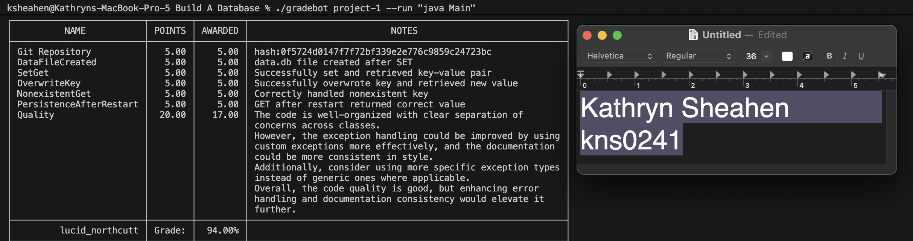

# Build A Database

**Name**: Kathryn Sheahen (kns0241)

**Class**: CSCE 4350.401

**Date**: March 15 2026

### Blackbox Testing (Gradebot)

### Linting and Formatting

* Language Support for Java by Red Hat (VSCode Extension)

    - Use: `> Format Document`

* Linting job auto runs on GitHub Actions (uses CheckStyle)

### AI Usage

* Utilized to assist with building a custom exception (i.e. DatabaseException.java).
    - Gradebot suggested adding custom exceptions in one of its feedback messsages.
    - Prompt: "Can you please help me build a custom exception class?" and gave it gradebot's feedback
* Asked for additional information about each built-in exception and error types.
    - Prompt: "Can you give me a list of exception and error types for Java?"
* Needed assistance with parsing arguments. 
    - I came across an error that was allowing for the commands to go through with 3+ arguments. 
    - Prompted: "When using the SET command with more than the key and value arguments, it still allows it to go through. What error type would be most appropriate to throw and do I need to adjust how I parse the commands?"

